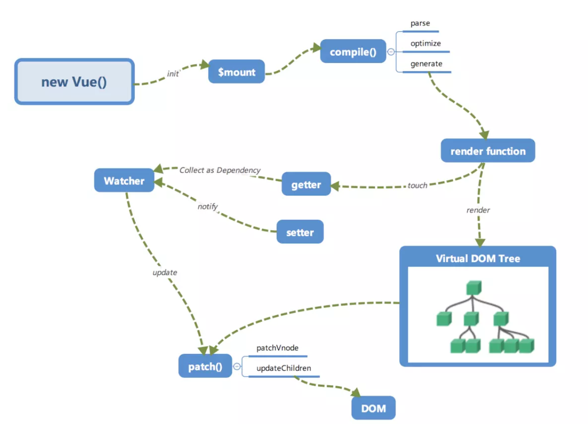
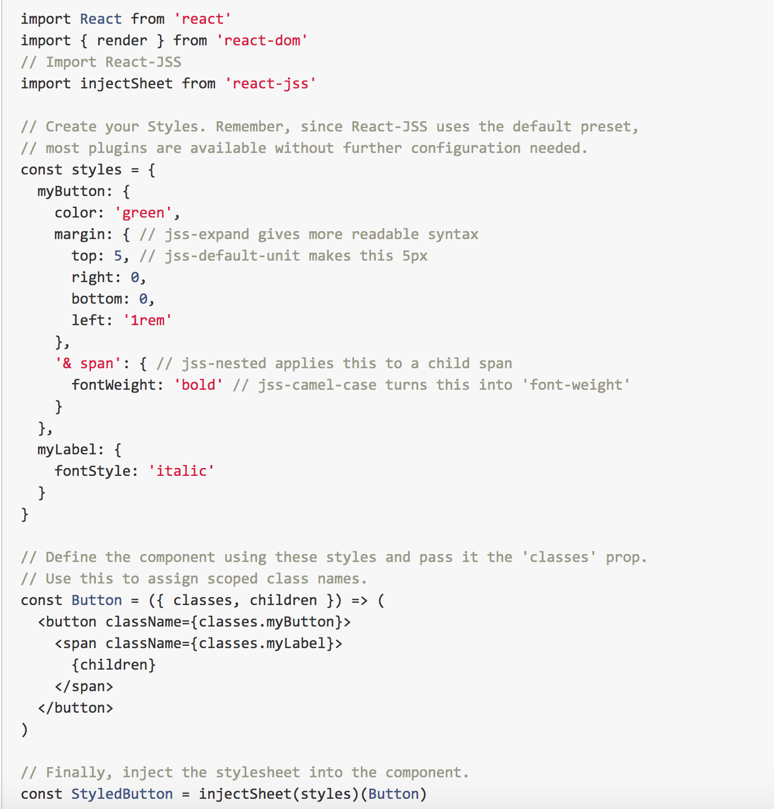
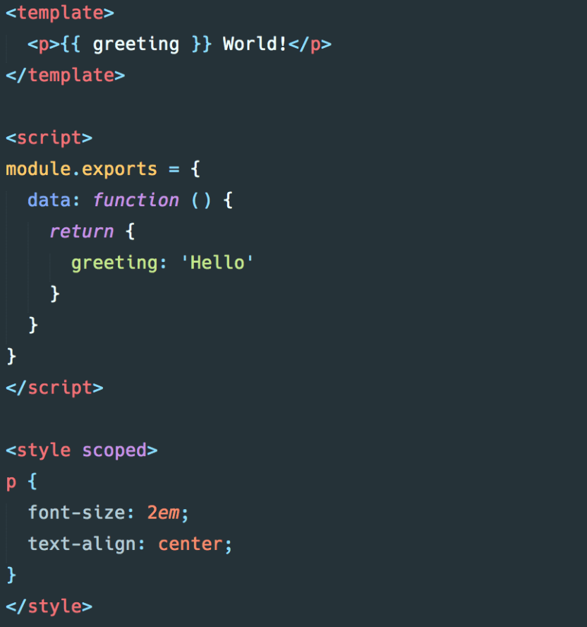
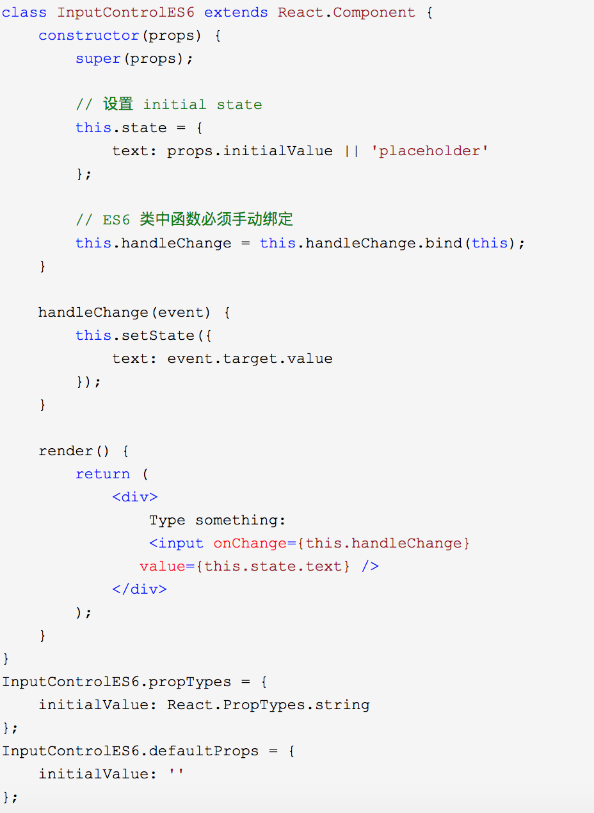
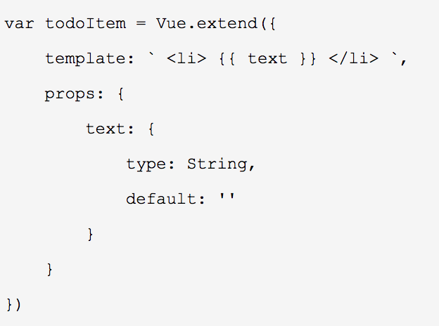
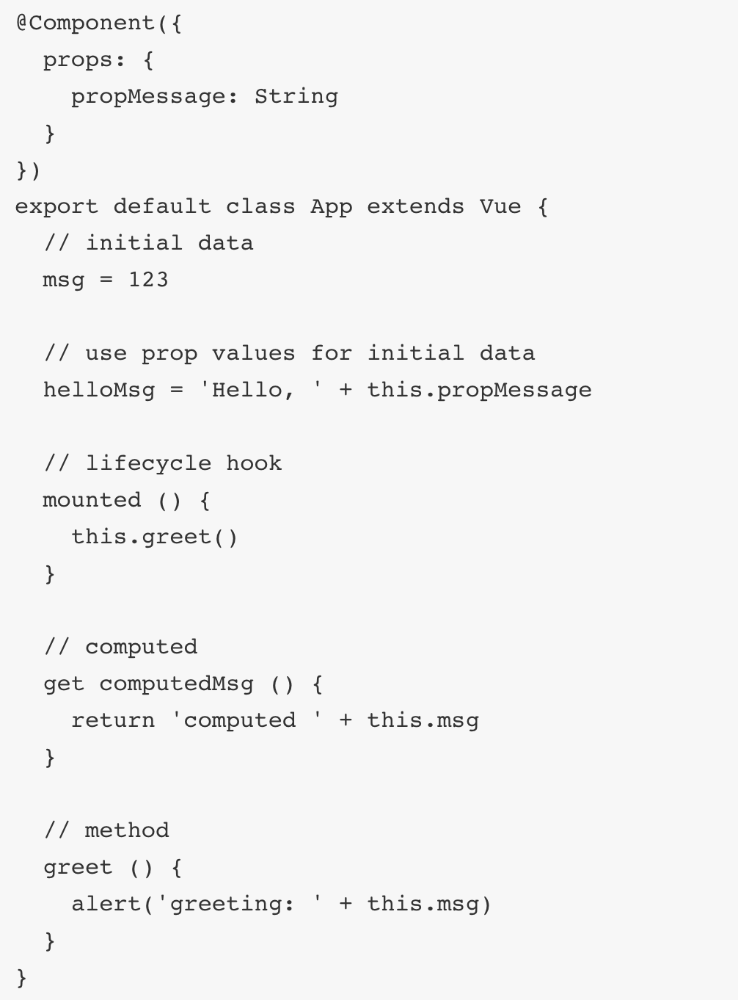
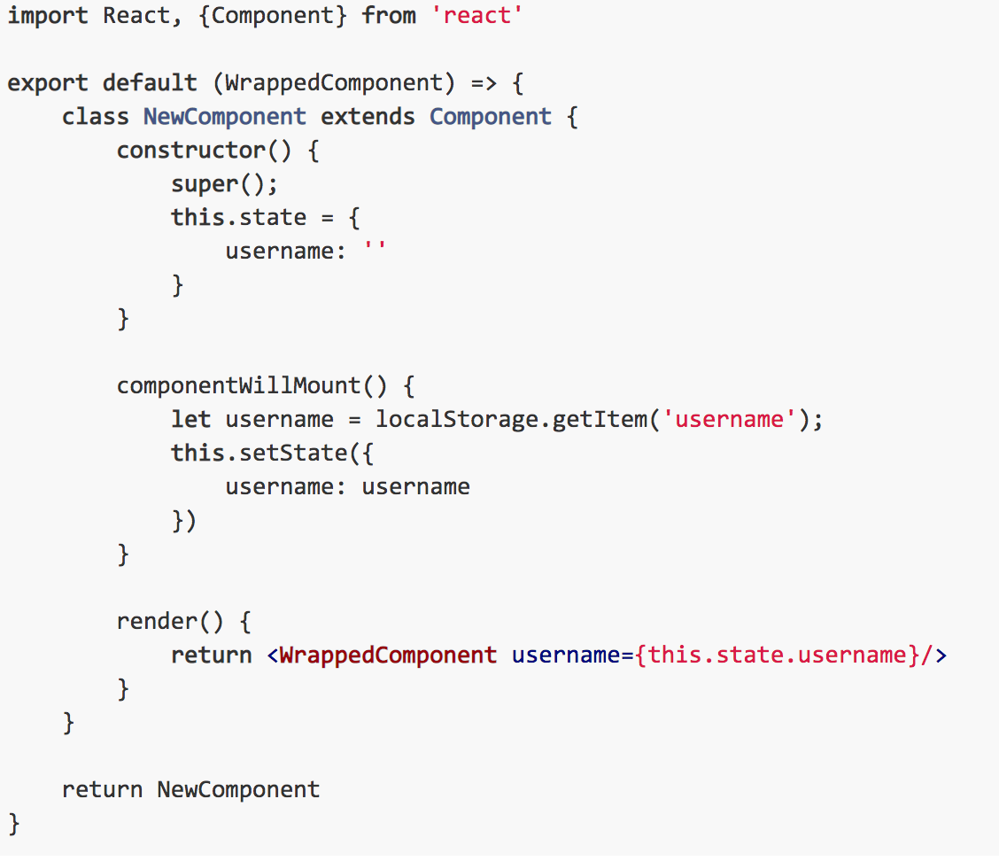
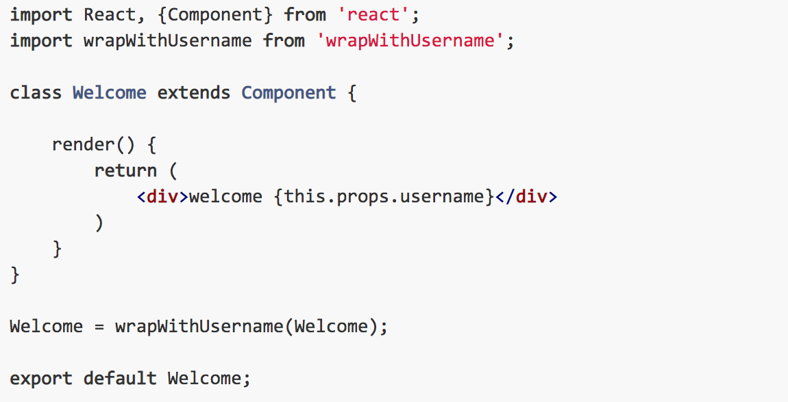
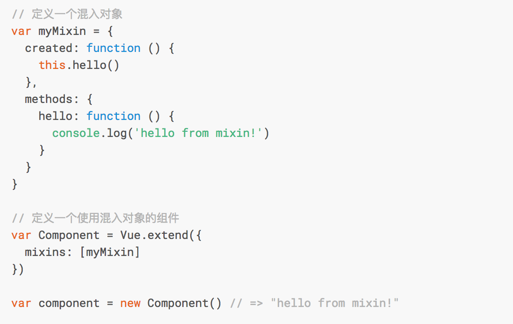
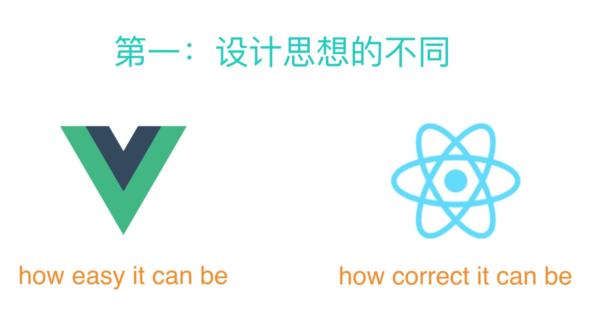

# vue and react 简单对比
## 1.数据改变方面

### react整体是函数式的思想，把组件设计成纯组件，状态和逻辑通过参数传入，所以在react中，是单向数据流，推崇结合immutable(https://www.jianshu.com/p/0fa8c7456c15)来实现数据不可变。react在setState之后会重新走渲染的流程，如果shouldComponentUpdate返回的是true，就继续渲染，如果返回了false，就不会重新渲染，PureComponent就是重写了shouldComponentUpdate，然后在里面作了props和state的浅层对比。

### vue的思想是响应式的，也就是基于是数据可变的，通过对每一个属性建立Watcher来监听，当属性变化的时候，响应式的更新对应的虚拟dom。

### 总之，react的性能优化需要手动去做，而vue的性能优化是自动的，但是vue的响应式机制也有问题，就是当state特别多的时候，Watcher也会很多，会导致卡顿，所以大型应用（状态特别多的）一般用react，更加可控。
## 2.通过js来操作一切，还是用各自的处理方式

### react的思路是all in js，通过js来生成html，所以设计了jsx，还有通过js来操作css，社区的styled-component、jss等

### vue是把html，css，js组合到一起，用各自的处理方式，vue有单文件组件，可以把html、css、js写到一个文件中，html提供了模板引擎来处理。

## 3.3.类式的组件写法，还是声明式的写法
### react是类式的写法，api很少

### 而vue是声明式的写法，通过传入各种options，api和参数都很多。所以react结合typescript更容易一起写，vue稍微复杂。

### vue结合vue-class-component也可以实现类式的写法，但是还是需要通过decorator来添加声明，并不纯粹。

### react可以通过高阶组件（Higher Order Components--HOC）来扩展，而vue需要通过mixins来扩展
#### 一个react高阶组件的例子：

#### vue的mixin的例子：

React刚开始也有mixin的写法，通过React.createClass的api，不过现在很少用了。
Vue也不是不能实现高阶组件，只是特别麻烦，因为Vue对与组件的option做了各种处理，想实现高阶组件就要知道每一个option是怎么处理的，然后正确的设置。具体有多复杂，可以参考下面的文章。
http://hcysun.me/2018/01/05/%E6%8E%A2%E7%B4%A2Vue%E9%AB%98%E9%98%B6%E7%BB%84%E4%BB%B6/
优劣势：https://www.cnblogs.com/eyunhua/p/6535038.html

## 4.什么功能内置，什么交给社区去做

react做的事情很少，很多都交给社区去做，vue很多东西都是内置的，写起来确实方便一些，
比如 redux的combineReducer就对应vuex的modules，
比如reselect就对应vuex的getter和vue组件的computed，
vuex的mutation是直接改变的原始数据，而redux的reducer是返回一个全新的state，所以redux结合immutable来优化性能，vue不需要。

## 总结

上面主要梳理了react和vue的4点不同：

- 数据是不是可变的
- 通过js操作一切还是各自的处理方式
- 类式的组件写法还是声明式的写法
- 什么功能内置，什么交给社区去做

（其中第3点在vue3.0支持类式写法之后就可以去掉了）
react整体的思路就是函数式，所以推崇纯组件，数据不可变，单向数据流，当然需要双向的地方也可以做到，比如结合redux-form，而vue是基于可变数据的，支持双向绑定。react组件的扩展一般是通过高阶组件，而vue组件会使用mixin。vue内置了很多功能，而react做的很少，很多都是由社区来完成的，vue追求的是开发的简单，而react更在乎方式是否正确。

